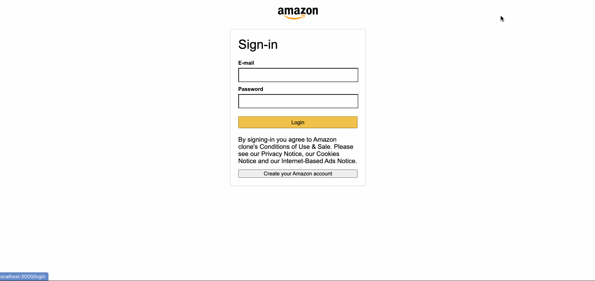
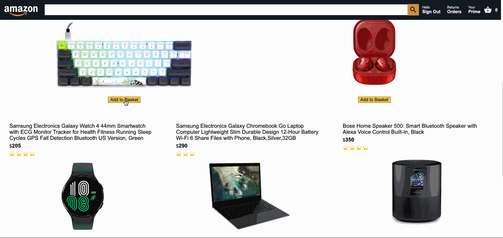
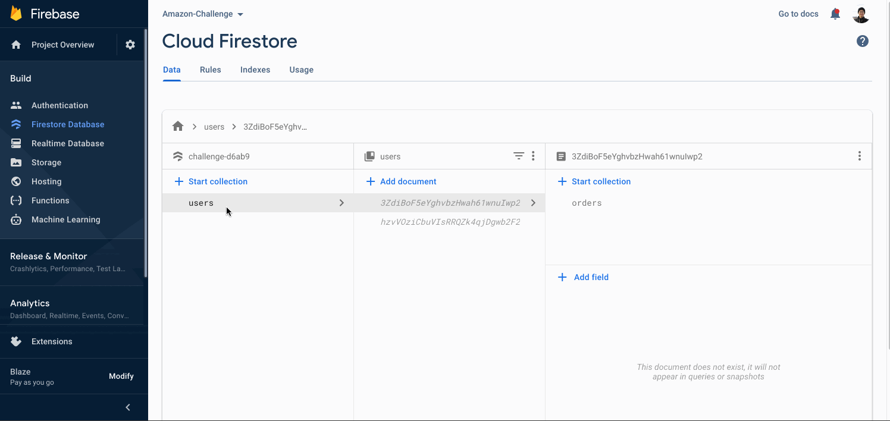

# Amazon-clone Project(Full-stack)
**Front-end dev and framework** : React.js | HTML | CSS

**Back-end dev and framework** : Node.js | Express.js

**Payment Platform** : Stripe

**Cloud Database Platform** : Firebase

**Hosting URL** : https://challenge-d6ab9.web.app

## To check out this project on your local machine

* Download this project
```
git clone https://github.com/zengjilie/amazon-clone.git
```
* Install dependencies
```
npm i @stripe/react-stripe-js
npm i @stripe/stripe-js
npm i firebase
npm i moment
npm i axios
npm i react-currency-format
...check out the package.json file
```

* Use Stripe and Firebase platform
1. Create account
2. Go to '/src/firebase.js', change firebase config to your own
3. Go to '/functions/index.js', change stripe secret key to your own

* Start react server

```
/amazon-clone
npm start 
//default: http://localhost:3000
```

* Turn on firebase emulator

```
/amazon-clone/functions
firebase emulators:start
```
* Register




* Make Payments




* Tracking Orders


